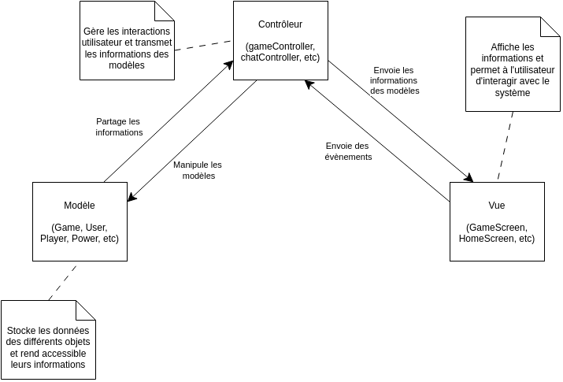

Projet CAWEB - Partie ACOL

CARRÈRE Bruno, GIEULES Damien, THIKEN Samuel, HUTH Guilherme, VOLAND Dorian

# (a) Analyse

## Description des acteurs

Dans le de notre projet, nous avons défini plusieurs acteurs grâce à la documentation que nous a été fourni.

    

 

- User est l'acteur principal de notre application, c'est lui qui fait les actions du jeu.
- Player représente les personnes physiques qui joue au jeu.
- Server quant à lui un acteur secondaire, il représente notre serveur et les actions qu'il effectue.

## Diagramme de cas d'utilisations

Chaque acteur peut faire différentes actions comme vous pouvez le voir ci-dessous.

    

    

 

### Diagrammes de séquences système

Nous avons choisi d'expliciter plusieurs cas d'utilisation à travers des diagrammes de séquence système

#### Chat

Pré-conditions:

- Le serveur doit être lancé.
- Les joueurs doivent être connectés

Post-conditions:

- Les messages sont reçus par tous les joueurs (Player x)

 

    

#### Création d'une partie

Pré-conditions:

- Le serveur doit être lancé.
- Les utilisateurs (User x) doivent être connectés

Post-conditions:

- La partie est bien créé

    

#### Déroulement d'une partie

Pré-conditions:

- Le serveur doit être lancé.
- Les Players doivent être connectés
- La partie doit deja être créé

Post-conditions:

- La partie est terminé

    

 

## Diagramme de classes d’analyse

Vous pouvez voir ci-dessous un diagramme de classe d'analyse pour la globalité de notre application.
Ce diagramme ne contient que les informations liées au serveur, et no contient pas d'élément lié de près ou de loin à l'affichage sur l'application. Ce diagramme ne contient pas non plus les éléments permettant l'interaction entre le client et le serveur

    

## Diagramme d'état transition

Nous avons jugé utile d'ajouter un diagramme d'état transition pour la partie client pour expliciter le déroulement d'une utilisation classique de l'application

    

# (b) Conception

## Architecture MVC

Pour ce projet, l'architecture choisie a été le modèle MVC, dont voici le détail

    

Ce modèle a été appliqué selon les responsabilités de chaque partie (backend et frontend), décrites sur le schéma suivant. De fait, la partie backend contient les modèles et les contrôleurs, tandis que le client contient les vues

    

## Conception détaillée

### Architecture du client

L'application est séparée en "activité" (pages). Voilà un diagramme expliquant la navigation entre les pages. La page "jeu" est quant à elle la plus complexe des pages, puisqu'elle doit afficher tous les éléments liés à la partie 

    

### Diagramme de classes logicielles

Le diagramme de classe logicielles correspondant au serveur est le suivant. De la même manière que le diagramme de classe d'analyse, ce diagramme ne contient pas l'affichage et la communication, qui sont expliqués plus loin dans ce document

    

### Communication client-serveur

Pour communiquer entre le client et le serveur, nous avons utilisé 2 technologies : HTTP et Websocket. Voilà comment ces technologies sont réparties dans l'application :

    

Utiliser ces deux technologies nous permet de cumuler les avantages des deux :
- en HTTP, nous pouvons faire des requêtes simples se basant sur le principe de question/réponse, ce qui est indispensable pour lister les parties, se connecter, etc
- en websocket, la communication est à double sens : le serveur peut envoyer des informations sans que le client ne demande quoi que ce soit. Cela nous permet de changer un état sur l'affichage du client sans demander explicitement si un changement est a effectuer. En utilisant cette technologie, on évite le "polling", qui consiste a demander régulièrement les modifications récentes, et qui, à grande échelle, apporte un stress conséquent sur le serveur

### Fonctionnement détaillés de fonctionnalités

Nous avons utilisé une implémentation basée sur des évènements (une variante du patron de conception observer) pour gérer les actions utilisateurs ainsi que les informations du serveur. Voici des diagrammes expliquant le fonctionnement :

Client :

    

    

Serveur :

    

    

Le fonctionnement est relativement simple :
- au lancement de l'application / instantiation des composants, des "event handler" (gestionnaires d'événements / écouteurs d'événements) sont enregistrés auprès du gestionnaire de la connexion. Côté client, ce dernier rôle est à la charge du GameContext, côté serveur, du EventManager. Ce fonctionnement permet de créer un dictionnaire associant un nom d'événement à une liste de fonctions
- à la réception d'un évènement, le gestionnaire lit le dictionnaire pour trouver toutes les fonctions qui doivent être appelées. Il récupère donc les données passés en même temps que l'évènement et transmet ces informations à chacune des fonctions, qui vont exécuter les actions prédéfinies

Ce système nous permet de mieux organiser le code en séparant les responsabilités des éléments, et nous permet de plus facilement étendre l'application

### Extensions

Nous avons conçu cette application en essayant d'appliquer au maximum les enseignements vus en cours et ailleurs, comme par exemple les patrons de conceptions, mais aussi des principes comme le principe SOLID

De cette manière, pour ajouter un nouveau pouvoir (et toute sa logique), il suffit, sur le serveur ou le client, d'ajouter un seul fichier, et de n'en modifier aucun autre. Toutefois, cette modularité n'est pas encore parfaite et certaines actions ne sont pas possibles uniquement en ajoutant un fichier. Cette modularité parfaite est une possibilité d'amélioration
