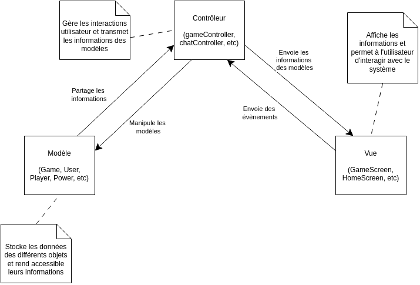

# Présentation du projet

<p align="center">
    
</p>


Le projet consiste à recréer le jeu Loup-Garou sur mobile et web. Pour ce faire, nous avons créé toute une application avec l'architecture MVC que vous pouvez voir ci-dessous.

<p align="center">
    
</p>


Pour ce projet, nous avons utilisé plusieurs technologies :

* React Native
* NodeJS
* Yarn
* Expo
* Plusieurs librairies (voir le fichier package.json)

# Documentation pour l'installation et les tests

**Cette documentation tient compte que vous avez déjà téléchargé le projet et installé nodejs et npm**

## Installation

La première étape est d'installer des librairies utilitaires avec la commande `npm i -g yarn ts-node expo`

Une fois le projet téléchargé, il faut dans un premier temps faire la commande `yarn install` dans les dossiers *server/* **et** *client/*

Cette commande va installer toutes les librairies nécessaires au projet.

### Frontend

Pour lancer l'application web il vous suffit d'aller dans le dossier *client/* et de faire la commande suivante dans un terminal :

```bash
yarn web
```

Cette commande va ouvrir un nouvel onglet sur votre navigateur par défaut faisant tourner notre site web.

Cette commande génère aussi un QR Code utilisable pour lancer notre application sur un mobile avec Expo.

### Backend

Pour lancer le serveur (backend), il suffit d'aller dans le dossier *server/* et de faire la commande suivante dans un terminal :

```bash
yarn fix && yarn start
```

La commande `yarn fix` fait les actions suivantes:

- install / update les paquets
- supprime la base de données (si elle existe)

La commande `yarn start` quand à elle lance le serveur

## Test

### Frontend

Pour effectuer les tests frontend avec cypress, il vous faut dans un premier temps lancer le serveur et le client (voir partie installation).

Puis dans un second, il faut ouvrir un nouveau terminal dans le dossier *client/* et faire la commande :

```bash
./node_modules/.bin/cypress run
```

Les tests Cypress E2E testent notre application web jusqu'à la création de parties. Nous ne pouvons pas aller plus loin parce que nous utilisons une librairie pour sélectionner la date et l'heure de début d'une partie et cette librairie n'est pas testable avec Cypress.

### Backend

Pour lancer les tests du backend, il faut :

Lancer le serveur (voir partie installation).

Puis, lancer les tests dans un nouveau terminal dans le dossier *server/* avec la commande :

```
yarn fix && yarn test
```

La commande `yarn test` lance les tests unitaires du serveur.
Les tests unitaires permettent de tester l'API de création d'un utilisateur avec toute la gestion de l'authentification et leur cas d'erreurs. Ils permettent également de tester la création d'une partie, le fait qu'un utilisateur puisse rejoindre une partie et vérifient bien les messages d'erreur en cas d'échec.
Ensuite, les tests unitaires permettent aussi de tester l'interaction de l'utilisateur avec le serveur à travers les websockets en prenant en compte l'authentification sur les websockets (et leur cas d'erreur) et la logique du jeu.
Pour tester la logique du jeu, les tests unitaires permettent de faire dérouler une partie complète sur une nuit et un jour avec les rôles et pouvoirs distribués de manières aléatoires afin de tester le maximum de cas possibles en terme de configuration du jeu.
Néanmoins, tous les événements passant dans les websockets n'ont pas pu être vérifiés par les tests unitaires car les tests partent du principe qu'ils connaissent l'ordre d'arrivée des événements. Ainsi, lors de l'attente d'un événement, certains peuvent être oubliés et donc pas vérifiés.
Même si cette lacune dans les tests unitaires ne permet pas de tester certains événements, sans l'assurance de l'existence de ces événements, le frontend ne peut pas fonctionner. C'est pourquoi le fonctionnement du frontend permet aussi d'assurer une certaine couverture de test du backend.

<br>

# Déploiement

Pour déployer le serveur (backend), nous avons choisi d'utiliser Microsoft Azure, notamment parce qu'il s'agit d'un outil reconnu et utilisé par de nombreux professionnels.
Le lien de notre application déployée est le suivant : http://98.71.171.44/ (le backend est au port 3000)
Toutefois, la configuration du projet dans le dépôt reste en locale, pour simplifier les tests.

# Documentation utilisateur

## Développement du backend

Il est possible d'étendre le jeu du loup-garou et de rajouter des pouvoirs. On peut imaginer des pouvoirs tel que le *<span style="color:black">Voleur</span>* qui échange son pouvoir avec quelqu'un d'autres, ou la mise en place de *<span style="color:black">Cupidon</span>* qui rend deux personnes amoureuses.

Afin de faciliter le mise en place de ces extensions, le développement du jeu a fait en sorte qu'il suffit de rajouter un fichier dans le répertoire `models/powers/` qui implémente le pouvoir.

Un pouvoir est représenté par une classe qui étends la classe `Power` en donnant les deux informations suivantes :

- le nom du pouvoir
- un booléen qui indique si le pouvoir s'applique immédiatement dans la nuit ou uniquement au début du jour

La classe du pouvoir implément uniquement deux méthodes :

- `applyPower`: permet d'appliquer le pouvoir
- `usePower`: effectuer des vérifications des conditions d'application du pouvoir et appelle `applyPower` uniquement si le pouvoir s'applique immédiatement la nuit.

Enfin, afin qu'un joueur puisse utiliser le pouvoir, il est nécessaire de créer un événement `USE_POWER_POWERNAME` associé à ce pouvoir dans la liste des événements et d'y associer la méthode usePower. Cette tâche se fait facilement avec la ligne de code suivante que l'on place à la fin du fichier, en dehors de la classe :

```ts
Event.registerHandlers("USE_POWER_POWERNAME", usePower);
```

Un dernier point pour ajouter un pouvoir est son initialisation au début de la partie. Pour cela, il suffit d'ajouter dans la classe de votre nouveau pouvoir la méthode `tryAssign` qui prend en paramètre une partie avec la liste des joueurs de cette partie et assigne le nouveau pouvoir en prenant en compte la probabilité d'apparition du pouvoir définit dans les paramètres de la partie et d'autres critères que vous pouvez définir dans cette méthode.
Enfin, il est nécessaire d'enregistrer le pouvoir dans la liste de tous les pouvoirs avec la ligne de commande suivante que l'on ajoute à la fin du fichier avec l'enregistrement de l'événement associé au pouvoir :

```ts
Power.registerPower(YourNewPower);
```

## Développement du frontend

De la même manière que pour le backend, le frontend permet un ajout de pouvoir simplifié. Le système n'est pas complètement modulaire, mais quelques légères modifications le permettrait. Pour ajouter un pouvoir, il faut ajouter un fichier dans client/components/game/powers, en implémentant 2 fonctions : Overlay() et PlayerActions(). Ces deux fonctions permettent respectivement d'ajouter un overlay dédié au pouvoir ainsi que d'ajouter dynamiquement des actions pour chaque joueur. Afin de rendre ces composants accessible, il est aujourd'hui nécessaire de les ajouter dans le fichier client/context/PowerContext, dans les fonctions getOverlay et getPlayerActions
